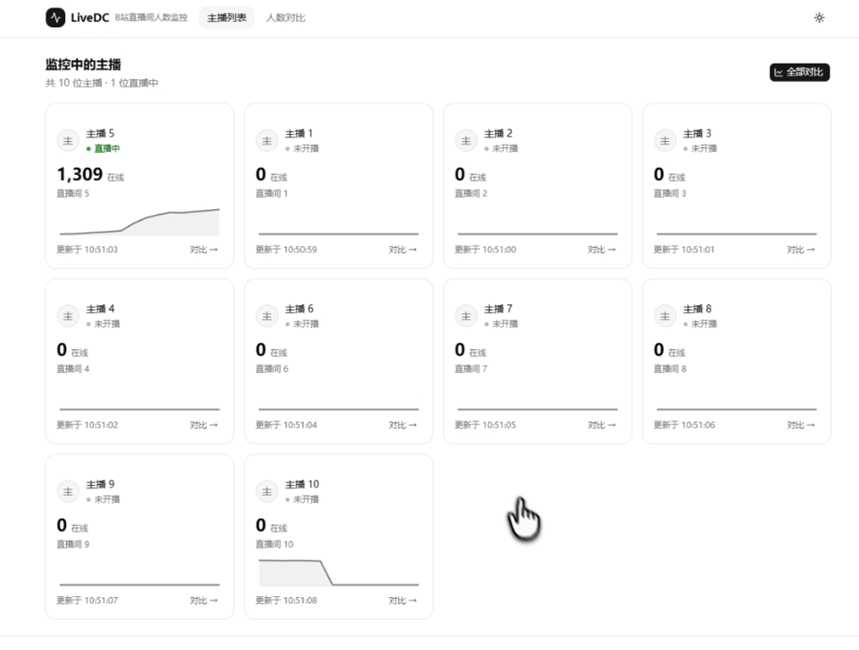
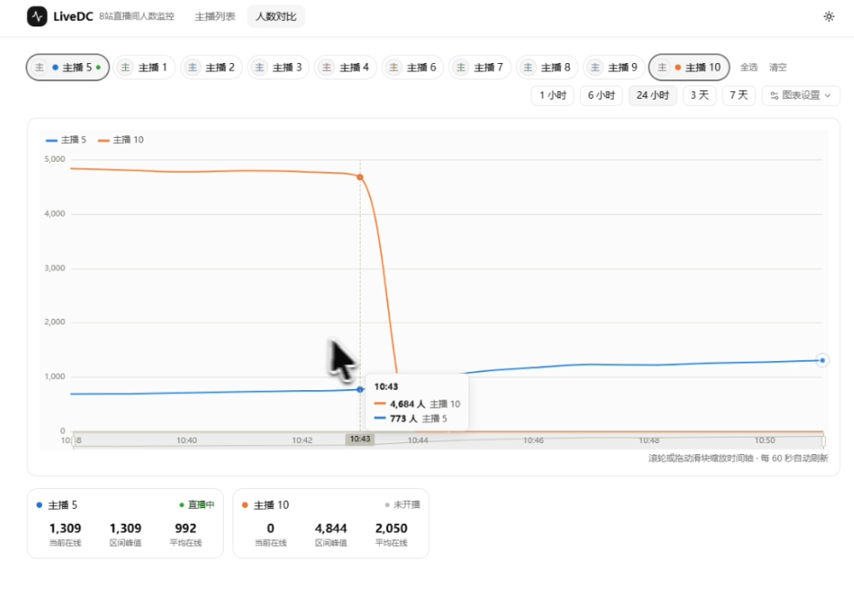

# LiveDC · B站直播间人数监控

> [!WARNING]
>
> 全是 AI 写的，README 也是

监控哔哩哔哩直播间的在线人数，支持多主播历史曲线对比。基于 Next.js + shadcn/ui。

|  |  |
| -------------------------- | ------------------------------ |


## 功能

- **主播列表**（首页）：所有监控主播的直播状态、当前在线人数、迷你趋势图，每 60 秒自动刷新
- **人数对比**：任选最多 8 位主播，在可缩放时间轴（滚轮 + 滑块）上对比在线人数曲线；支持 1 小时～7 天时间范围、绝对人数 / 峰值百分比两种视图、区间统计（当前 / 峰值 / 平均，仅统计直播中时段）
- **主播管理**：输入直播间链接或房间号即可添加（自动解析主播信息）；一键删除；可选密码保护

## 快速开始

```bash
npm install
npm run dev
```

打开 http://localhost:3000 ，进入「管理」页添加主播（如 `live.bilibili.com/6`），然后到「人数对比」选择主播查看曲线。

数据保存在 `data/liver-dc.db`（SQLite）。采集器随服务启动自动运行，默认每分钟抓取一次。

## 配置（可选）

复制 `.env.example` 为 `.env.local` 后按需修改：

| 变量 | 默认值 | 说明 |
|---|---|---|
| `POLL_INTERVAL_MS` | `60000` | 采集间隔（毫秒） |
| `MIN_FETCH_GAP_MS` | `20000` | 同一主播两次抓取最小间隔 |
| `FETCH_CONCURRENCY` | `4` | 同时抓取的主播数上限 |
| `SNAPSHOT_RETENTION_DAYS` | `7` | 历史采样点保留天数 |
| `ADMIN_PASSWORD` | 未设置 | 设置后管理页与增删接口需要密码登录 |
| `DB_PATH` | `./data/liver-dc.db` | SQLite 数据库路径 |

## 生产部署

```bash
npm run build
npm start
```

> 采集器通过 `instrumentation.ts` 在 Node 服务启动时运行，需部署在常驻进程（VPS / 自托管）而非 Serverless 平台。

## 技术说明

- **数据采集**：公开接口 `room/v1/Room/room_init`（短号解析）+ `xlive/web-room/v1/index/getInfoByRoom`（主播信息），**实时在线人数**只取在线榜接口 `xlive/general-interface/v1/rank/queryContributionRank` 的 `data.count`；未开播时段按 0 记录
- **存储**：SQLite（better-sqlite3），`streamers`（主播）+ `snapshots`（采样点），WAL 模式，过期数据自动清理
- **图表**：ECharts（按需引入，时间轴 dataZoom 缩放），色板遵循 dataviz 可访问性规范，明暗主题独立配色
- **对比 API**：时间序列按 min/max 分桶降采样，保证 7 天区间也能流畅渲染
